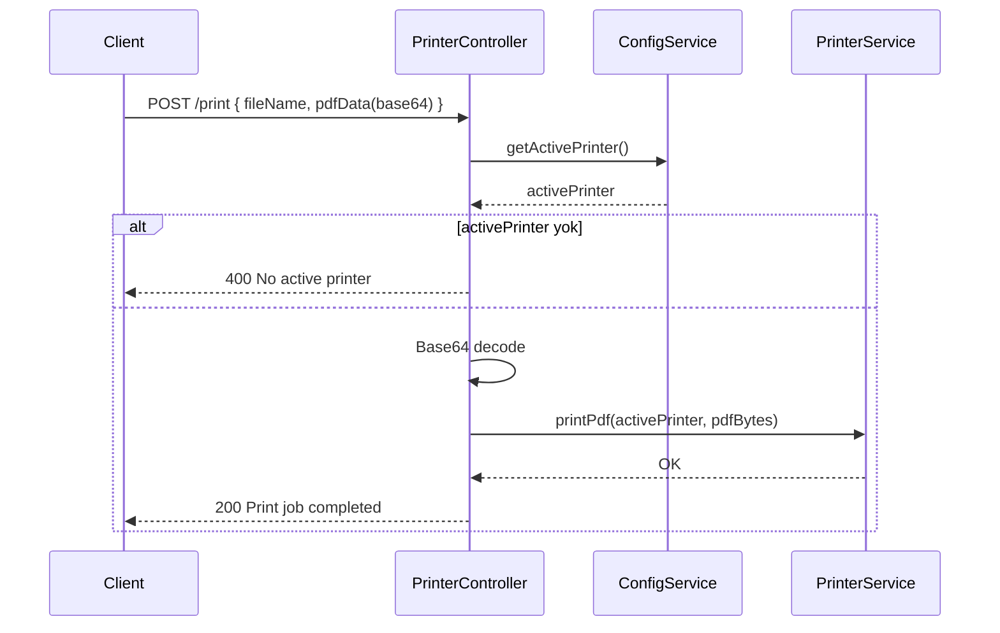

# Alpidi Printer Agent – Uygulama Akış Dokümantasyonu

Bu doküman, `alpidiprinteragent` uygulamasının nasıl çalıştığını aşama aşama ve “neden” yapıldığını açıklamak için hazırlanmıştır. Uygulama Java 17+ ve Spring Boot tabanlıdır ve yerel işletim sistemindeki yazıcılarla etkileşim kurarak uzaktan yazdırma işlerini yerine getirir.

## 1) Genel Mimari Özeti
- **Uygulama girişi**: `src/main/java/com/alpidiprinteragent/alpidiprinteragent/AlpidiprinteragentApplication.java`
  - Spring Boot uygulamasını başlatır. `@EnableScheduling` ile zamanlanmış görevleri (cron) aktif eder.
- **HTTP API (REST Controller)**: `controller/PrinterController.java`
  - Yazıcı listesi, aktif yazıcı atama, yazdırma, konfigürasyon görüntüleme/güncelleme uçlarını sunar.
- **İş mantığı servisleri**: `service/`
  - `PrinterService`: Yerel yazıcıları listeler, PDF verisini yazdırır.
  - `ConfigService`: `printer-config.json` üzerinde aktif yazıcı ve yazdırma ayarlarını yönetir.
  - `PrinterSyncService`: Zamanlanmış görev ile arka uçtan (backend) varsayılan aktif yazıcıyı senkronize eder.
  - `PlatformServiceWrapper` + `{Windows, Mac, Linux}ServiceWrapper`: OS’e özel başlatma/tepsi ikon davranışları ve servis/daemon modları.
- **Model**: `model/PrinterInfo.java`
  - Basit veri taşıma nesnesi (DTO) örneği.
- **Kaynaklar**: `src/main/resources/application.properties`
  - Sunucu portu, log seviyesi ve `backend.base-url` gibi ayarlar.
- **Yerel konfig dosyası**: `printer-config.json`
  - Aktif yazıcı ve kullanıcı bilgisi gibi kalıcı ayarlar.

## 2) Başlangıç (Startup) Akışı
1. `AlpidiprinteragentApplication.main()` çağrılır ve Spring Boot konteyneri ayağa kalkar.
2. `@EnableScheduling` sayesinde zamanlanmış görevler (örn. `PrinterSyncService.syncActivePrinter`) planlanır.
3. OS’e göre başlatma:
   - Üretim paketlerinde `service/PlatformServiceWrapper.main()` kullanılabilir. Bu sınıf `os.name` bilgisini kontrol ederek ilgili sarmalayıcıya yönlendirir:
     - Windows: `WindowsServiceWrapper.main()`
     - macOS: `MacServiceWrapper.main()`
     - Linux: `LinuxServiceWrapper.main()`
   - Amaç: Kullanıcı deneyimini artırmak (sistem tepsisi/menü çubuğu entegrasyonu), servis/daemon modunda başlatmak ve hatalara dayanıklılık.
4. HTTP sunucusu `application.properties` içindeki `server.port=9000` ile 9000 portunda dinlemeye başlar.

## 3) Platform Sarmalayıcıları – Neden Varlar?
- **Amaç**: Uygulamanın farklı işletim sistemlerinde:
  - Servis/daemon (headless) olarak veya masaüstü modunda çalışabilmesini sağlamak.
  - Sistem tepsisi/menü çubuğunda ikon gösterip kullanıcıya kısayollar sunmak (Web arayüzünü aç, yeniden başlat, çıkış vb.).
- **WindowsServiceWrapper** (`service/WindowsServiceWrapper.java`)
  - Headless argümanları (`--headless`, `--service`) veya GUI desteğine göre tepsi ikonu ile/olmadan başlatır.
  - Tepsi menüsü: Web arayüzünü aç, uygulamayı yeniden başlat, çıkış.
- **LinuxServiceWrapper** (`service/LinuxServiceWrapper.java`)
  - `DISPLAY` değişkeni/masaüstü ortamı tespiti ile headless veya tepsi ikonlu modda çalışır.
  - Linux’ta tarayıcı açmak için `xdg-open` gibi yardımcılar denenir.
- **MacServiceWrapper** (`service/MacServiceWrapper.java`)
  - macOS’ta varsayılan olarak headless modda servis gibi çalıştırır. (Gerektiğinde menü bar entegrasyonu için yardımcı metotlar mevcuttur.)
- **PlatformServiceWrapper** (`service/PlatformServiceWrapper.java`)
  - OS tespit eder ve uygun sarmalayıcıya delegasyon yapar. Hata durumunda doğrudan Spring Boot uygulamasını başlatır (dayanıklılık).

## 4) HTTP API Uçları ve Akışları
Kaynak: `controller/PrinterController.java`

- GET `/i-am-here`
  - Amaç: Sağlık/erişilebilirlik kontrolü. Basit bir “agent çalışıyor” yanıtı döner.

- GET `/printers`
  - Amaç: Sistemdeki yazıcı adlarını listelemek.
  - Akış: `PrinterService.getPrinters()` → `PrintServiceLookup` ile yazıcıları çeker.

- GET `/printers-details`
  - Amaç: Yazıcıların isim, konum, URI ve diğer niteliklerini detaylı listelemek.
  - Akış: `PrinterService.getPrintersDetails()` → `PrintServiceAttributeSet` üzerinden öznitelikleri toparlar.

- POST `/printers/active`
  - Amaç: Aktif yazıcıyı belirlemek ve kalıcılaştırmak.
  - Girdi: `{ "printerName": string, "productionPartnerUserId": string }`
  - Doğrulama: `printerName` boş olamaz.
  - Akış: `ConfigService.setActivePrinter(printerName, productionPartnerUserId)` → `printer-config.json` güncellenir.

- POST `/print`
  - Amaç: Base64 kodlu PDF verisini, aktif yazıcıya göndermek.
  - Girdi: `{ "fileName"?: string, "pdfData": base64-string }`
  - Doğrulamalar:
    - `pdfData` boş olamaz ve geçerli Base64 olmalıdır.
    - `ConfigService.getActivePrinter()` ile aktif yazıcı atanmış olmalıdır.
  - Akış: Base64 → byte[] decode → `PrinterService.printPdf(printer, pdfBytes)` → yazdırma.
  - Başarıda: yazıcı adı, dosya adı, boyut, zaman damgası içeren başarılı yanıt.
  - Hata durumlarında: açıklayıcı mesaj, `status=false`, uygun HTTP kodu.

- GET `/config`
  - Amaç: Mevcut konfigürasyonun tamamını JSON olarak döndürmek.

- POST `/config/print-settings`
  - Amaç: Yazdırma ile ilgili parametrik ayarları (`printSettings`) JSON altında güncellemek/eklemek.
  - Akış: `ConfigService.setPrintSettings(key, value)` per-anahtar bazında kaydeder.

- POST `/config/reset`
  - Amaç: Yerel `printer-config.json` dosyasını silerek konfigürasyonu sıfırlamak.

### CORS
`PrinterController` sınıfında `@CrossOrigin` ile aşağıdaki kaynaklara izin verilir:
- `http://localhost:4200`, `https://alpidi.com`, `https://app.alpidi.com`, `https://test.alpidi.com`, `https://stage.alpidi.com`

## 5) Yazdırma Akışı (Detay)
Kaynak: `service/PrinterService.java`

1. `PrinterService.printPdf(printerName, pdfData)` çağrılır.
2. `PrintServiceLookup.lookupPrintServices` ile mevcut yazıcılar alınır ve `printerName` ile eşleşen yazıcı seçilir.
3. `DocFlavor.INPUT_STREAM.AUTOSENSE` kullanılır; böylece sürücü/OS PDF stream’ini uygun şekilde işler.
4. `DocPrintJob` oluşturulur ve `SimpleDoc` ile byte stream yazdırmaya verilir.
5. İstisnalar üst katmana fırlatılarak Controller’da ele alınır; böylece kullanıcıya anlamlı hata döner.

Neden bu şekilde?
- `javax.print` API’leri OS seviyesindeki yazıcıları standart bir arayüzle kullanır.
- `AUTOSENSE` ile farklı içerikler için sürücüye otomatik algılama imkanı tanınır.

## 6) Konfigürasyon Yönetimi
Kaynak: `service/ConfigService.java`, dosya: `printer-config.json`

- Aktif yazıcı ve `productionPartnerUserId` bilgisi JSON dosyasında saklanır.
- Okuma-yazma işlemleri `java.nio.file.Files` ile yapılır.
- `setPrintSettings(key, value)` herhangi bir yazdırma ayarını `printSettings` altında saklar (String/Integer/Boolean türleri desteklenir, aksi halde `toString`).
- `resetConfig()` dosyayı silerek sıfırlar.

Avantajı:
- Basit, harici bir veri tabanı gerektirmez.
- İnsan tarafından okunabilir ve yedeklenmesi kolaydır.

Dikkat:
- Uygulama çalışma dizinindeki `printer-config.json` dosyası işletim iznine ve çalışma konumuna bağlıdır.
- Çok kullanıcılı makinelerde kullanıcı başına konumlandırma stratejisi gerekebilir.

## 7) Zamanlanmış Senkronizasyon (Cron)
Kaynak: `service/PrinterSyncService.java`

- `@Scheduled(cron = "0 0 7 * * ?", zone = "America/New_York")`
  - Her gün New York saatine göre 07:00’de çalışır.
- Akış:
  1. `ConfigService.getProductionPartnerUserId()` ile kullanıcı kimliği alınır.
  2. `application.properties` içindeki `backend.base-url` kullanılarak şu uç çağrılır:
     - `GET {backend.base-url}/api/public/printer/{productionPartnerUserId}/default-active`
  3. Yanıt `statuscode == 200 && status == true` ise `data` alanındaki yazıcı adı yerel olarak güncellenir.
  4. Fark varsa `ConfigService.setActivePrinter()` ile kalıcılaştırılır ve log yazılır.

Neden?
- Backend’te tanımlı varsayılan yazıcı ile ajan makinadaki aktif yazıcının senkron kalması.

## 8) Uygulama Ayarları
Kaynak: `src/main/resources/application.properties`

- `server.port=9000`
- `spring.main.banner-mode=off`
- `logging.level.org.springframework=ERROR`
- `backend.base-url=http://localhost:8080`
  - Not: Üretimde bu adres ortama göre değiştirilmeli (env değişkeni veya dış konfig ile). Arada boşluk olmamasına dikkat edin.

## 9) Sıra Diyagramı (Yazdırma İsteği)

## 10) Hata Yönetimi ve Loglama
- Controller seviyesinde girdi doğrulama hatalarında 400 (Bad Request), beklenmeyen hatalarda 500 (Internal Server Error) döndürülür.
- Hata mesajları kullanıcıya açıklayıcı olacak şekilde gövdeye eklenir (`status=false`, `message`, `errorCode`).
- Servisler içinde yakalanan IO ve ağ hataları loglanır (`logger` veya `e.printStackTrace()`); kritik durumlarda kontrollü çıkış.

## 11) Güvenlik ve CORS
- `PrinterController` üzerinde `@CrossOrigin` ile belirli alan adlarına izin verilir:
  - `http://localhost:4200`, `https://alpidi.com`, `https://app.alpidi.com`, `https://test.alpidi.com`, `https://stage.alpidi.com`
- Üretimde CORS ve kimlik doğrulama ihtiyaçları ortama göre sıkılaştırılmalıdır.

## 12) Nasıl Çalıştırılır?
- Java 17+ kurulu olmalıdır.
- Port: `9000` (özelleştirilebilir)
- Komutlar (örnek):
  - Geliştirme: `mvn spring-boot:run`
  - Jar ile: `java -jar target/alpidiprinteragent-<version>.jar`
  - OS özel wrapper ile (paketleme senaryoları): `PlatformServiceWrapper.main` üzerinden.
- Test için uçlar:
  - `GET http://localhost:9000/i-am-here`
  - `GET http://localhost:9000/printers`
  - `POST http://localhost:9000/printers/active` body: `{ "printerName": "...", "productionPartnerUserId": "..." }`
  - `POST http://localhost:9000/print` body: `{ "fileName": "test.pdf", "pdfData": "<BASE64>" }`

## 13) Önemli Notlar ve İyileştirme Önerileri
- `application.properties` içindeki `backend.base-url` üretimde ortam değişkeni veya dış config ile yönetilmeli.
- `printer-config.json` konumu kullanıcı dizinine taşınabilir (örn. `~/.alpidi/printer-config.json`) ve izinler gözden geçirilebilir.
- Yazdırma işinde sayfa yönü, kopya sayısı, renkli/siyah-beyaz gibi `printSettings` kullanımı genişletilebilir.
- Cron zaman dilimi ve saat, iş gereksinimlerine göre konfigüre edilebilir.
- Log seviyeleri (`logging.level.*`) ve hedefleri (file/rotate) üretimde ayarlanmalıdır.

---
Bu doküman, `alpidiprinteragent` uygulamasının uçtan uca akışını ve bu akışların arkasındaki gerekçeleri hızlıca anlamak için referans niteliğindedir.
